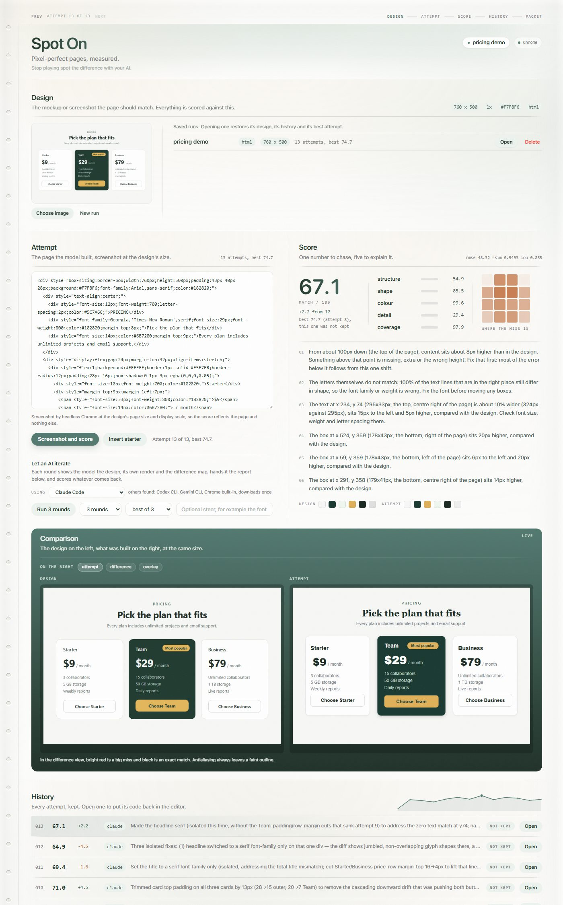

# Spot On

**Pixel-perfect pages, measured.**

Stop playing spot the difference with your AI.

You hand a coding model a design and ask for the page. It builds something close. You say the spacing is off and the button is the wrong colour. It says "fixed". You put the two side by side, squint, and write the next correction. Twelve rounds later it is still not quite right, and neither of you can say how close it is or whether the last change helped at all.

Spot On takes a screenshot of the page, scores it against the design out of 100, draws where the two disagree, and writes down what to fix first in sentences a model can act on. Every attempt is kept, so "closer" becomes a number that either went up or did not.



## What it does

- Screenshots a running page (`http://localhost:5173/pricing`), or pasted HTML, SVG or canvas code, with headless Chrome at the design's exact page size and display scale.
- Scores the result out of 100, split into five parts that each fail for a different reason, so the report can say which kind of mistake was made.
- Draws a difference map: bright red where the page misses the design, black where it matches.
- Notices when content is shifted rather than wrong. One missing label near the top pushes the whole page down, and a plain pixel comparison then reports everything below it as broken. Spot On reports the shift and where it starts instead.
- Names the elements that miss, in CSS pixels: which text is 9% wider, which boxes are 4px shorter, what sits 7px to the right, what is missing entirely. Page-wide numbers stop being useful once a page is close, and a model given only them starts making sweeping changes that break what already matched.
- Says when the font is wrong, and only when it is: text lines that sit in the right place are lined up and compared letter by letter, since the same string in Arial and in Segoe UI is nearly the same width.
- Keeps every attempt with its score and a note on what changed.
- Writes a feedback packet to paste back to whatever wrote the code, or runs the loop itself.

Overlay extensions such as [PerfectPixel](https://www.welldonecode.com/perfectpixel/) lay a design over a live page so a person can line the two up by eye. Spot On is built for the other half of the job: telling a model, in numbers and sentences, how far off it is and what to change.

## Two ways to run the loop

**On a real project.** The code lives in a repo, so the loop runs in the coding session that edits it. After each change the session scores the page from the command line, reads the difference map, and fixes the first problem in the report. If a change lowers the score, it is undone. Each call is recorded in the same run history the page shows.

```
python spot-on.py score design.png http://localhost:5173/pricing --scale 2 --run pricing --note "fixed card padding"
```

**On a snippet.** For pasted HTML, an SVG or canvas code with no repo behind it, the page can run the loop by itself: render a first attempt, then press **Run 3 rounds**. Each round shows the AI the design, its best render so far and the difference map, hands it the report, and scores what comes back. It builds on the best attempt, not the latest, so a round that made things worse is discarded instead of compounded. Each round asks for **three rewrites at once and keeps the highest scoring one**, which evens out the luck of a single draw; the others stay in the history marked "not kept". Change it in the page (1 try each, best of 2, 3 or 5), with `--candidates` on the demo script, or with `SPOT_ON_CANDIDATES`. They run in parallel, so a round takes about as long as one rewrite and costs as much as that many.

While the page is far off, a round fixes everything the report names. Once it is close, a round may change at most three things, each on a named element, because sweeping edits ("set a line height on every text element") were what repeatedly undid good rounds. Every round is also told which earlier changes lowered the score, so it stops re-trying them.

## Which AI runs the loop

Whatever you already have. Spot On looks for these in order and uses the first one it finds:

| Agent | Needs | Sees the images |
|---|---|---|
| Chrome built-in (Gemini Nano) | Chrome 148+ on desktop, one model download | yes, in the page |
| Claude Code | `claude` on PATH, signed in | yes, it opens them itself |
| Codex CLI | `codex` on PATH | only if that CLI can open local files |
| Gemini CLI | `agy` on PATH | only if that CLI can open local files |
| Anthropic API | `ANTHROPIC_API_KEY` | yes, sent with the request |
| OpenAI API | `OPENAI_API_KEY` | yes, sent with the request |
| Ollama | running locally, a vision model pulled | yes, sent with the request |

**Nothing installed and no account? Chrome can do it.** Recent Chrome desktop ships a small model (Gemini Nano) behind the `LanguageModel` API. When the browser has it, Spot On offers it in the list automatically and runs the round inside the page: no key, no account, no cost, and nothing leaves the machine. The first use downloads the model, which needs free disk space and either a GPU with more than 4GB of VRAM or 16GB of RAM. It is a small model, so expect it to make coarser changes than the hosted ones, and to struggle on a long page. It is the free way in, not the best result. For a larger local model, Ollama with a vision model is the next step up.

Pick a different one in the page, or set `SPOT_ON_AGENT` (`claude`, `codex`, `gemini`, `anthropic-api`, `openai-api`, `ollama`). `SPOT_ON_MODEL` picks the model; the defaults are Sonnet for Claude Code, `claude-sonnet-5`, `gpt-4o` and `llava`, and model names change, so set it if a request is rejected. The API calls are plain HTTP, so no provider SDK has to be installed.

An agent that cannot open local files still gets the whole written report, which is the part that says what to fix; it just cannot look at the difference map. **If none of them is available, nothing breaks except the automatic loop**: scoring, the difference map, the history and the feedback packet all work, and the packet is written to be pasted into any chat window.

Keys and accounts stay on your machine. The page never talks to any provider itself, and never asks anyone to sign in; the local server makes the call, using the account signed in there, and that account's usage is what gets spent.

## The score

| Part | Weight | What it measures | What a low number usually means on a page |
|---|---|---|---|
| structure | 40% | SSIM over 7px windows, on the drawn content | border radius, borders, shadows, font size or line height |
| shape | 25% | overlap of the drawn area with the design's, as intersection over union | width, height, padding, gap or alignment |
| colour | 20% | distance between the two palettes, in both directions | a background, text or button colour is wrong or missing |
| detail | 15% | correlation of edge density over a 9px window | missing text, icons or borders, or the wrong font weight |
| coverage | caps the total | share of the design with something drawn within 6px of it | an element that was never built |

The four weighted parts make a subtotal, and coverage scales it: `match = subtotal x (0.6 + 0.4 x coverage)`. A page that leaves out a fifth of the design can reach at most 92% of what it would otherwise score.

Each of these choices fixed a case where the score disagreed with what the eye sees:

- **Structure and detail are measured on the drawn content**, not the whole page. Averaged over empty space, leaving an element out scored better than drawing it slightly wrong.
- **Colour compares palettes, not pixels.** Per-pixel colour over the drawn area was really measuring position, so a three pixel offset was punished three times.
- **Detail is blurred before it is compared.** Without that, one pixel of antialiasing difference read as badly as missing detail, and a near-identical copy scored in the fifties.
- **Coverage caps the score.** Even with the three fixes above, a design with one element removed could still edge out a close copy of the whole thing.

### Calibration

A design with a circle and a square, and seven attempts at it, each rendered by Chrome. Regenerate with `python scripts/calibrate.py`.

<!-- calibration:start -->
```
case    match  structure  shape  colour  detail  coverage  what it is
exact    97.7       95.6   99.1    99.8    98.1     100.0  identical to the design
close    88.8       85.4   94.6    99.7    73.6     100.0  3px offset and a slight hue shift
half     80.7       88.5   84.1    83.8    84.9      85.0  the square left out entirely
hue      84.6       95.3   99.1    35.0    98.2     100.0  right geometry, wrong colour
shift    51.2       65.3   46.7    99.8     0.0      71.8  right colours, 40px to the right
wrong    32.8       62.8   42.7    24.0     0.0      52.0  one wrong shape in the wrong place
blank    14.5       60.3    0.0     0.1     0.0       0.0  nothing drawn
```
<!-- calibration:end -->

Do not chase 100. Text rendering and antialiasing leave a floor a few points below it, and the report says so when that is all that remains.

## A worked example

`docs/demo/design.html` is a pricing section standing in for a design export. `docs/demo/first-attempt.html` is a plausible first pass: same content, but the small PRICING label is missing, the fonts and button styles are different, and the highlighted plan is not filled. The automatic loop then ran from there. Regenerate with `python scripts/demo.py`; model output varies, so a rerun gives different numbers.

<!-- demo:start -->
```
attempt  match  structure  shape  colour  detail  coverage  source   what changed
      1   19.9       28.8   13.1    51.6     1.1      46.9  manual   hand-written first pass
      2   56.1       41.3   67.2    98.4    24.5      97.6  claude   Rebuilt to match the actual design: added the missing "PRICING" eyebrow, pushed the header/cards block down (~28-38px) to fix the vertical offset, made the Team card a dark-green (#183830) featured panel with a gold "Most popular" pill and gold CTA button, switched price format to "$X / month", tightened card gap to ~12px, and grew card padding/line-height so card and button heights match the reported box sizes.
      3   47.7       35.4   61.3    98.4     0.0      92.4  claude   Added 'Liberation Sans' to the font stack (metric-compatible with Arial) to fix the widespread ~4-13% text/box overwidth the report flagged, which points to a Linux font-fallback substitution; tightened header spacing (padding-top 44→36, title/subtitle margins 10→8, row margin-top 28→22) and card internals (padding 24→22, line-height 1.8→1.7, feature/button/price margins trimmed) to remove the ~14-23px vertical overage below the fold, especially in the Team card.
      4   52.3       37.3   65.4    98.5    19.4      92.6  claude   Dropped font-weight 800→700 on the title and price numbers (800 has no real face in most fallback sans-serif fonts and was being synthesized as an over-wide, over-black faux-bold, the clearest visual difference vs the reference); trimmed price-block margin (14→10), feature-list margin (16→12) and line-height (1.8→1.6), and button margin-top (20→14) to remove the cumulative vertical excess inside each card that grows from ~6px near the price line to ~23px by the button, without touching header spacing (which already lines up correctly against the reference).
      5   58.3       40.9   68.4    98.4    37.8      97.8  claude   Replaced flexbox `gap:12px` with per-card `margin-right:12px` (gap unsupported in the render engine would add ~8px extra width per card, matching the reported 186-vs-178 button width discrepancy exactly: 24px unswallowed gap / 3 cards); trimmed row margin-top 28→22 and internal card spacing (price margin 14→11, feature margin 16→13, line-height 1.8→1.65, button margin-top 20→15, feature font-size 13→12, Team badge padding 4/12→3/10) to remove the cumulative vertical excess without touching font-weight or the header block, which already score well.
      6   54.2       39.2   66.8    98.5    23.2      93.7  claude   Fixed the vertical rhythm causing the 150px-down offset (padding-top 44→48, subtitle margin 10→4, card-row margin 22→32, tuned from measured pixel deltas in reference vs 005.png rather than the earlier all-at-once attempt-4 trims); switched title and all three price numbers from font-weight 800→700 in isolation (no accompanying margin cuts this time) since 800 has no real Arial face and was being synthesized into an over-wide faux-bold, which explains the reported overwidth on both the title and the price text; widened the card gap 12px→20px to shrink the two outlined buttons toward the reported 179px target and shift the Team/Business cards right by ~4px to correct their left-shift.
```
<!-- demo:end -->

What the run shows:

- **The first report named the cause, not the symptom.** It did not say everything is wrong. It said content sits about 38px higher than the design from roughly 50px down, and that something above that point is missing. That something was the small PRICING label.
- **A confident fix made it worse, and the number caught it.** Round 3 decided the text was in a substituted font and added `Liberation Sans` to the stack. It scored 47.7, down from 56.1. The loop discarded it, told the next round what had failed, and round 5 reached the best score of the run.
- **Later rounds work element by element**, because that is what the report gives them: which text is a few percent too wide, which card is too tall, what sits a few pixels off.

**The numbers move between runs.** Rendering and scoring do not: the same code scores the same, and three renders of one page differed by zero pixels. The model does. Each round is a fresh sample, and the loop is a greedy climb, so the big rebuild in round 2 sets a ceiling that later rounds only nudge. Runs from this same starting point have finished anywhere from the high fifties to the low seventies. Taking the best of three rewrites per round is the lever against that, at three times the cost; the run above was one rewrite per round.

## Running it

```
pip install -r requirements.txt
python spot-on.py              # http://127.0.0.1:7265
python spot-on.py 7266         # another port
```

Needs Python 3.10 or newer (numpy, pillow and scipy), and Chrome or Edge. Set `SPOT_ON_CHROME` if the browser is somewhere unusual. The server binds to 127.0.0.1 only and nothing is uploaded; it only fetches the page you point it at.

**Capture scale.** A screenshot from a 150% Windows display or a Retina Mac is larger than the page it shows. A 2880px-wide design of a 1440px layout was captured at 2x. Pick the matching scale when starting a run, or pass `--scale`, so the page is rendered at its real width. The wrong scale triggers a different responsive breakpoint, and every score after that measures the wrong layout.

**Command line.**

```
python spot-on.py score <design.png> <url-or-file> [--kind url|html|svg|canvas]
                        [--scale 1|1.25|1.5|2] [--run NAME] [--note TEXT] [--json]
```

It prints the report, the change from the previous attempt, the best score so far, and the paths of the design, the screenshot and the difference map.

## Limits

- **Fonts.** A model cannot reliably read a typeface off a screenshot. The report says the font is wrong only when text that sits in the right place still has the wrong letter shapes, which is the honest evidence for it, but if the design's font is known, say so up front and skip the guessing. If the font is not installed at all, text will never line up exactly and the ceiling drops with how much text the page has.
- **Moving content is excluded, and the exclusion is measured.** Chrome renders on a virtual clock, so two captures of the same page at the same settle time land at the same point in an animation: a real app with a drifting hero and a 3D avatar scored 99.3 against itself with nothing excluded. What does move (random content, video, live data) is found on the first attempt of a running page, by screenshotting it three times and comparing the last two, and is then excluded from every score and painted slate blue in the difference map. On that app the moving area was 0.65% of the page and the ceiling 100.0. The first capture is thrown away on purpose: a cold page is still loading fonts and lazy chunks, and measuring that would mask out real content for the whole run.
- **A page that moves everywhere cannot be scored.** If more than 60% of it changes between captures (a video background, a full-bleed animation), Spot On excludes nothing, says so, and tells you the number is mostly measuring motion. Excluding that much would leave nothing to compare and every attempt would come back a meaningless 100.
- **A design screenshot taken by hand is not on that clock.** If the design is a screenshot of the same app, capture it through Spot On (or with the same settle time), or the animation will sit at a different point in the two images and the difference is real but unfixable. Capturing one design at 6000ms and scoring it against attempts at 4000ms cost 19 points on an otherwise identical page.
- **States.** A design showing a hover, an open menu or a filled form is compared against the page's default state unless the page is put in that state.
- **Viewport only.** The screenshot is exactly the design's size. A design of one section needs a URL or component that renders that section at that size.
- **It can be gamed.** Putting the design image itself on the page as a background would score near 100. Nothing detects that; the tool assumes the goal is a page that looks like the design because it is built like it.

## Tests

```
python -m unittest discover -s tests -v
```

Scoring, guards and geometry run anywhere. The server and screenshot tests need Chrome or Edge and are skipped without one. `tests/test_docs.py` fails if the calibration or demo tables in this README drift from the files the scripts generate.

## Layout

One file, `spot-on.py`: the scorer, the screenshot step, the HTTP server and the page. Runs are written to `runs/<name>/`: the design, a `run.json`, and one `.code`, `.png`, `-diff.png` and `.json` per attempt. Deleting a run folder deletes the run.

## License

MIT
