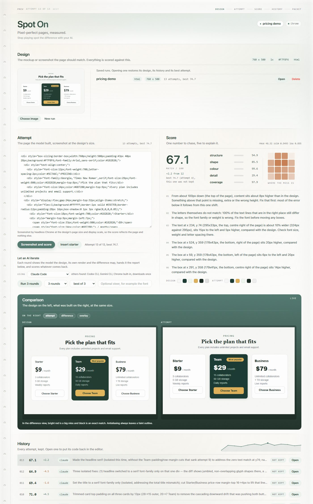

# Spot On

**Pixel-perfect pages, measured.**

Stop playing spot the difference with your AI.

You hand a coding model a design and ask for the page. It builds something close. You say the spacing is off and the button is the wrong colour. It says "fixed". You put the two side by side, squint, and write the next correction. Twelve rounds later it is still not quite right, and neither of you can say how close it is or whether the last change helped at all.

Spot On takes a screenshot of the page, scores it against the design out of 100, draws where the two disagree, and writes down what to fix first in sentences a model can act on. Every attempt is kept, so "closer" becomes a number that either went up or did not.



## What it does

- Takes the design as an image (a Figma export, a screenshot) **or as a link**: paste a page and Spot On captures it through the same renderer the attempts use, so both sit on the browser's virtual clock and an animation lands in the same place in each. That makes "does my rebuild still match production" a one-line check.
- Screenshots a running page (`http://localhost:5173/pricing`), or pasted HTML, SVG or canvas code, with headless Chrome at the design's exact page size and display scale.
- Scores the result out of 100, split into five parts that each fail for a different reason, so the report can say which kind of mistake was made.
- Draws a difference map: bright red where the page misses the design, black where it matches.
- Notices when content is shifted rather than wrong. One missing label near the top pushes the whole page down, and a plain pixel comparison then reports everything below it as broken. Spot On reports the shift and where it starts instead.
- Names the elements that miss, in CSS pixels: which text is 9% wider, which boxes are 4px shorter, what sits 7px to the right, what is missing entirely. Page-wide numbers stop being useful once a page is close, and a model given only them starts making sweeping changes that break what already matched.
- Names the page colour when it is wrong, and says where it is most wrong: "the design is #F9FBFE there and the attempt is #D4E0F8". A gradient can match at the edges and be far off in the middle, so pointing at the border colour would send the next round chasing nothing.
- Names the spacing, not just the positions: "the gap above this text is 113px, the design has 22px". A gap is the distance between two elements, so it does not move when the whole page shifts, and it is the number that maps onto the margin being edited. Two lines of one block are reported as line-height instead, on that block alone.
- Treats a column as a column: elements that share a left edge in the design are checked together, so a ragged or shifted column is one container's padding rather than one complaint per element.
- **Notices what it cannot explain.** Every sentence records the kind of fault it names, and a component scoring below 80 with nothing accounting for it is said out loud instead of passing quietly. This is the check that would have caught the colour blind spot on its own: colour sat at 64.5 for six rounds while every sentence was about text, and nothing was watching for the silence.
- **Measures rows across, not only columns down.** A row of navigation links is spaced along the other axis; the report used to say each link "sits 43px to the right", once per link, which reads as five faults when it is one. Rows of three or more are compared on their median gap and named once, as the container's spacing.
- **Names the typeface when the design is a link**, by reading what the page asks for rather than guessing from letter shapes. Offered only when the glyph check already says the font is wrong.
- **Presses on what it already asked for.** Each round is told which faults were named in an earlier round and are still there, and how many rounds they have survived. A round that ignored the first problem gets one more go before the loop hands back. After three rounds on the same fault it stops asking, because at that point the honest reading is that it cannot be fixed in code, and the round is told that saying so is an allowed answer.
- Measures the type rather than guessing at it: how tall the text is (font-size), how much of its box is ink (font-weight). "About 17% wider, check font size, weight or letter spacing" offered three suspects and left the model to pick; "21px tall where the design is 23px" is a value it can set.
- **Reads the design once and writes down what it needs.** The materials line says what the tool can do, and it is the same sentence for a page of flat cards and a page with a 3D globe, forty-five icons and translucent panels. Which half matters is a property of the design, and the design is right there, so a round asks once, from the image, and every round after it is told: "about 45 icons: 6 nav, 6 orbit-menu, 8 coloured app logos, 4 weather... all panels are translucent glass over a blurred dark cityscape... one glowing 3D globe with orbit rings... no chart or map." Kept separate from the materials line rather than replacing it, because the tool's half goes stale when the tool gains something and this half does not. A failure here never blocks a round.
- Takes a line saying **what the rebuild may build with**, sent with every round: inline SVG for icons and for curved or radial shapes, `conic-gradient` for dials, blur and rgba for translucent panels, and three.js for a 3D object. Left to guess, a model writes plain boxes, so a gauge comes out square and a wifi glyph comes out missing, and the report then reports the square box rather than the reason for it. The default keeps everything drawn by the page itself, because anything fetched makes a run depend on the network.
- **Scores each element separately, and twice**, because one number over a whole page is an average and an average hides where the work is. Each element of the design gets a score where the design puts it, and a second score against whatever in the attempt was recognisable as the same element, scaled to the same size. The pair of numbers is the instruction: a card at 24 in place and 87 like for like is built correctly and sitting in the wrong spot, so move it and change nothing inside it; one that is low both ways needs redrawing; one with no partner at all was never drawn. Element scores compare with each other, not with the page total, which is measured over the whole page at once.
- **Scores each ninth of the page** as well, when no element stands out. One page measured 70.7 while its own ninths ran from 41 to 73. This is also why a big page seems to stall: a part worth a tenth of the pixels can be fixed outright and move the total two or three points.
- Names **a panel at the wrong alpha**: a translucent card over a dark page whose fill is several levels too light or too dark. Nothing else here can see it. Its geometry is right, so no element line fires; it is too small a share of the page to move the palette and it is not the page behind the content, so neither colour sentence fires either. On a rebuilt dashboard every panel came out five to nine levels too light and the report said nothing at all. Reported only when several panels are wrong the same way, because one panel off is that panel and four off in the same direction is the fill rule behind all of them.
- **Orders the report by what is absent, not by what is biggest.** A thing that was never drawn, or is wrong everywhere at once, outranks a thing that is present and a few percent off. The list is read in order and attention thins out down it, so position is priority: the line naming seven empty icon wells was correct and sat at number 11 of 16, below four boxes a little too narrow, and was named every round without ever being reached. It was worse than that at the time, because a round could then change at most three things, so number 11 was not merely unlikely to be reached but arithmetically out of reach. The one exception is the wrong typeface, which stays first because it makes every box around it measure wrong too, so fixing it deletes complaints rather than adding one.
- **Tells a round where the dead ends are before it chooses.** A round used to be told it could change at most three things, and that budget was being spent on work nobody would ever do: the first item on one page was a typeface that is not installed, and it held the top of the list for twenty rounds. Giving up on a fault used to stop it being pressed and nothing else, so on that page all eight tracked faults were given up, the "you were asked already" section was empty every round, and the mechanism had gone from selective to inert. The faults still appear in the report, because they are real and the measurement will keep reporting them, and because "cannot be done in code" is a judgement a later round with a better idea may overturn. What changed is that the round is now told which ones have been paid for repeatedly and never moved, and to spend itself elsewhere. The budget has since been measured and removed, which makes the dead-end list less urgent and no less true.
- **Asks which glyph, and says where to get it.** The empty-container line names each well, and against each one it says what the bundled set knows about the glyph the design draws there. The reason it matters is measured: filling seven wells with the design's own pixels is worth 2.4 points of the per-element score, and the round's own plausible-but-wrong icons were worth nothing at all. An icon is not the icon, and pixel for pixel that is nearly all of the difference.
- **What the set can actually tell you about a glyph, which is less than it looks.** Each of the 1856 distinct drawings in the set was rendered again the way a rebuild draws one, at 16 to 32px, three stroke widths, light on dark as well as dark on light, nudged and scaled inside its cell, and half the arms blurred and JPEG compressed (`scripts/icon_trial.py`, 48 arms against a sanity arm that comes out at 100%). The result is an asymmetry, and the whole design of this rests on it. A low score is good evidence of absence: at 32px a drawing that **is** in the set scores at least 0.80 against itself 98.7% to 100.0% of the time. A high score is not evidence of presence: at that same threshold, 24.2% to 51.0% of glyphs that are **not** in the set reach it against their nearest neighbour, because at icon size many marks resemble many other marks. So the report says "nothing in the set is this shape, draw it inline" below 0.80, and prints a name only at 0.92 with 0.03 clear of the nearest different drawing, where the false-name rate falls to 0.5% to 7.0% and the names it does print are right 97.1% to 99.9% of the time. Plain shapes are never named: "the glyph here is circle" is true, useless, and crowds out the line that matters.
- **And the survey that reversed the point of it.** Over every icon-sized box in the 7 distinct designs on this machine (92 boxes, `scripts/icon_real.py`), the set has nothing of that shape for 42 of them and prints a name for 2. These are generated images, and their glyphs are brand marks and one-off drawings no icon set contains. The old line told every round to search the set for whatever it saw, every time, which was wrong for most of the page it was printed on, and it explains the measurement above: the loop was not choosing badly from the set, the thing it was looking for was not in there. The useful half of matching turned out to be the half that says to stop looking.
- **Records the same comparison aggregated five ways**, and selects on none of them yet. One number over a page is an average, and an average hides small things: a 30x24 icon well on a 1536x1024 page is 0.046% of it, so a loop optimising the score will not spend a round there. `page` weights every pixel equally. `sections` weights each ninth of the canvas equally. `elements` gives every detected element one vote, 160 of them on one real page. `elements_sqrt` weights each by the square root of its area, so a 1200x400 banner outweighs that icon by 25 to 1 rather than 667 to 1. `elements_tail` averages the worst tenth, which a few badly wrong elements cannot be averaged away from. All five are computed over the elements of the design, never the attempt, so a candidate cannot improve its score by drawing extra small things. They are recorded rather than adopted because the plain mean is the sensitive one and also the gameable one, and because the question "would weighting it differently have chosen a different page?" is answerable from runs that already happened.
- **Can let the named work break a tie**, off by default behind `SPOT_ON_REPAIR`. Every attempt records how much of what the report asked for is still outstanding, measured on the pixels of each named rectangle rather than on whether a detector still fires, so dropping a transparent element into an empty box clears the detector and moves nothing here. Subtracting that from every candidate and taking the best decides nothing, which was the first version: it prices the state a page is in and the candidates of one round share that state, so across 82 waves on disk the penalty spread within a round has a median of 0.005 against a fidelity spread of 0.85. In 8 of those 82 the candidates differed more in what they had closed than in how close they looked, one of them by 0.20 of fidelity against 0.37 of penalty, and choosing on fidelity there is a coin toss that ignores the work. So fidelity decides, and only inside a 0.5 tolerance does the page that closed more win. The tolerance is measured against the best fidelity in reach rather than the best to hand, or every round spends it again and ten rounds walk a page down five points while each step looks free. Trialled on one page over four rounds: it cleared both outstanding findings and held them cleared, for 0.3 of fidelity against the control, and in the same run it stopped climbing while the control gained 0.2 more. One run, one page, so it ships off.
- **What that measured, which was not what was expected.** Pasting the design's own pixels into seven empty icon wells, a perfect repair of 0.65% of the page, is worth +0.3 on `page`, +2.4 on `elements` and +1.6 on `elements_sqrt`: the score can see the job, and weighting by element multiplies the signal by eight. But when the loop actually filled three of those wells, every view moved by zero or slightly less. It had captured none of the gain that was there. So the limit on this page is not how the score is weighted, it is that the loop puts an icon where the design has a particular icon, and pixel for pixel that is barely better than leaving the box empty. Eight times nothing is still nothing. `elements_tail` gained exactly zero on the same test, because the worst tenth of that page is artwork rather than icon wells: a sound aggregate aimed at the wrong thing.
- **Keeps the list the rounds were already writing.** A third of the notes on this machine say what a round could not do or did not get to: the typeface is not installed, the values could not be worked out from the report, the file write was denied, the empty-box item is still open. Across 463 notes, 8% name something blocked and 25% something left, and none of it was ever read again. A round now answers with three fields beside its code, for what blocked it, what it did not reach, and which open items it finished; asking is free because the answer is already JSON, and asking beats parsing, since those phrasings have nothing in common to match on. The open list goes to the next round, so whoever closes an item is whoever says so, and the page shows it as bullets with the finished ones struck through. What blocked a round is listed apart, because those are not work to be done but reasons work cannot be. The round is told that naming an item it did not do buys nothing, since the report measures the page and not the list: a candidate once reported a script as blocked in the same round another ran it, and rounds have claimed work they had not done. Anything a detector backs keeps being named by the report regardless, which is the check; the rest is the loop's own account and is labelled as that.
- **Puts every attempt that could be the best on one scorer.** A run's whole history hangs off which attempt it thinks is best: each round builds on it, and a new attempt is kept or discarded by comparing against its number. Those numbers were each written by whatever the scorer was on the day and nothing recorded which, so a run could be ranking pages by two different metrics without saying so. Measured across twelve runs here: eight had drifted by 0.4 points or less, one by -1.3, one by +6.5, and one by +13.2. That last one believed its best was attempt 10 at 54.3 when attempt 4 scores 72.8 today, so every round of it had been built on the wrong page. Reports carry a `SCORER_VERSION`, and when it moves, the contending attempts are re-scored together before a base is picked or a challenger is judged, each keeping what it used to be as `rescored_from`. Only attempts within 20 points of the best are touched, because scoring a hundred attempts takes minutes and the largest drift ever seen here is 13.2. It happens once per bump; the cost lands on the next round after one.
- **Ships an icon set**, 2121 of them, offline. A report that says "the design puts an icon in each of these wells" is correct and still leaves a rebuild inventing seven glyphs by hand, which is how a page ends up with icons from seven different hands. Every round is told the set exists and how to search it by name or keyword, the empty-container line points at the same command, and the round is allowed to run it. That last part was missing at first, and it made the rest of it worthless: headless mode denies any command that asks for approval, so twelve rounds in a row answered that the script needed permission they could not get and drew their glyphs by hand anyway. What is permitted is one command and nothing else. Because the rule is matched against the literal text of a command, under the name of the tool that runs it, the round is handed a two-line shim under a fixed name rather than the script's own path, and every spelling of that one command is allowed under both shells. Both halves of that were found by reading what a round actually did rather than reasoning about it: `python icons.py` ran while `python ./icons.py` and `python3 icons.py` were refused, and then, with all the spellings covered, a round on Windows still reached for the PowerShell tool first and was refused four times before falling back to Bash. A round with a page to rebuild does not always spend four tool calls finding that out, which is what a candidate reporting the script as "not permitted" turns out to mean. Which icons a page really took from the set is read off the page itself and stored with the attempt, matched on geometry inside a single `svg` so that resizing and recolouring, which is what the script is for, does not hide them. The round's own sentence about it is not evidence: establishing that one round had genuinely used the set meant matching path data out of the index against the page by hand. The markup is inlined, so nothing is fetched at render time and a run never depends on the network. Lucide, ISC, vendored with its licence.
- **Says what the page needs from a person, and keeps going without it.** Three faults no amount of code closes, because the material is not on the machine: the design's typeface, a glyph no icon set here contains, and artwork. All three were already measured and then reported as ordinary work, which is the wrong frame, because a round reads "the font family is wrong" as a job and spends itself on another stack. They are not retired: they stay in the report, rounds keep improving around them, and closer still scores better. What is added is a standing note that something could be handed over that moves it further than any round can, and what that would be worth. The typeface waits three rounds before it is asked for, because choosing a better stack is a real repair a round often makes; artwork and an absent glyph are properties of the design, known from the first comparison, so they are said at once. Resistance is what turns a fault into a request.
- **Takes the material and makes the page able to load it.** A file handed over lands in the run's own `materials/` folder under a name reduced to a slug and a suffix, so nothing can escape the run. The loading is the part that had to be right: an attempt is written to a temporary folder and opened over `file://`, so `materials/bg.png` resolves to nothing unless the folder travels with it, and a round that referenced a supplied image would have rendered a broken box and scored worse for doing as it was told. The renderer copies the folder in beside the page, and so does the stability pass, which decides which pixels are excluded from every score of the run. The round is told the exact paths rather than that files exist, because a round told "the background is available" writes a guess and a guess renders as nothing. A test renders a page against a supplied image and reads the pixel back; the same page without the folder comes back white.
- **Can go and look for the material, on a press, and only fetches what was picked.** Icons come from Iconify, which indexes most of the free sets, so "an icon set you would like" is a search rather than a bundling job. Images come from Openverse, chosen over Unsplash and Pexels because those want an API key and because the licence travels with the result, which matters for a file that ends up in a design; it is stored in the run beside the download. Typefaces come from Google Fonts, by name and falling back to category, with the file pulled from the family's own stylesheet. Searching for a font was left out at first on the reasoning that a lookalike is the same bad substitution as a lookalike icon, and the runs disagree: across 135 attempts here whose change mentions the font, 17 cut the share of wrong letters by a third or more, one went from every line wrong to none, and the best single change was worth 26.0 points of match. Most do nothing, which is what best-of-N is for.
- **What the icon set can tell you about a glyph, which is less than it looks.** Each of the 1856 distinct drawings was rendered again the way a rebuild draws one, at four sizes, three stroke widths, both polarities, nudged and scaled, half the arms blurred and JPEG compressed (48 arms against a sanity arm that comes out at 100%). The result is an asymmetry and the whole design rests on it: at 32px a drawing that **is** in the set scores at least 0.80 against itself 98.7% to 100% of the time, so below that the set does not have it, while 24% to 51% of glyphs that are **not** in the set also reach 0.80 against their nearest neighbour. So the report says "nothing in the set is this shape, draw it inline" below 0.80, and prints a name only at 0.92 with 0.03 clear of the nearest different drawing. Then the survey that reversed the point of it: over every icon-sized box in the seven distinct designs here, 92 of them, the set has nothing of that shape for 42 and can name 2. These are generated images whose glyphs are brand marks and one-off drawings. The old line told every round to search the set for whatever it saw, which was wrong for most of the page it was printed on, and it explains the measurement above. The useful half of matching turned out to be the half that says to stop looking.
- **Lets a round say the report is wrong, and counts who agrees.** A report item was false for twenty rounds while every round that looked at it declined, correctly, and three features were built to force compliance, because nothing could read a refusal as evidence about the instruction rather than about the model. A round can now answer `disputed`: the item's own words, then what it actually sees there. Offered only on faults that have already survived three rounds, since a fault nobody has been asked about twice is not evidence of anything, and the schema asks for the observation rather than the verdict, which is the cheap thing that caught the false finding. Two separate rounds have to agree before the tool repeats it, because one round is an opinion and models are agreeable enough that asking the question invites a yes. Once agreed the fault stops being pressed and the person is told what the rounds saw. It is not deleted: the measurement still reports it, the rounds can be wrong together, and a later round that can see the report is right is invited to fix it anyway.
- Names **containers drawn empty**: a nav chip, an icon well or a button that is the right size in the right place with nothing inside it. Two readings have to agree before it says so: the inside has to look different, and the design's inside has to be materially more marked than the attempt's. Texture alone is not enough, and getting that wrong cost twenty rounds. On a dark HUD the design's rings carry a glow that bleeds inward, which reads as interior detail, so five circles that were empty in the design and empty in the attempt were reported as drawn empty and held problem #2 while the loop looked at them, saw nothing missing and declined. The loop was right and the report was wrong. The coverage gate is +20 points, chosen from 123 flagged boxes across every run here: the verified-wrong ones reach +14.9 at most and the lowest verified real one is +23.2, so it sits in the gap. On an early attempt whose icons genuinely were not drawn it still names all eight places; on the page above it now names one. Every geometric check passes on those, because the box really is correct, so nothing used to be said while every icon on the page was missing. When it is happening everywhere it is said once, as one job rather than twenty, and every box is named by position. That last part is the difference between the item being read and the item being done. It used to give a count and a size range, so a round was asked to find eight boxes between 69x71 and 30x24 pixels somewhere on a page of 1536x1024, while every other line in the report carries an x and a y; the count sat unmoved for six rounds. Handed the same report with the boxes listed, one round closed three of the seven places and took three new icons from the set. The score did not move either time, which is the point: an item this small is worth 0.4% of the page, so it will never be done because it pays, only because it was asked for in a way that can be acted on. The sentence also says that filling them all counts as one change. That was written when a round could change at most three things, where "fill all eight of these" was a rule it could not keep, so it kept neither; the budget is gone now and the sentence is kept because it says plainly that the job is one job.
- Says when part of the design is **artwork rather than layout**: a photograph, a render, an illustration. Those are many distinct colours and dense detail at once, which flat interfaces never are, and no number of rounds will close the gap. The report names it so the loop stops spending rounds there, and so the rest of the report reads as being about everything else.
- **Says when the text is the wrong colour, and does not confuse that with the weight.** The type measurements were height, density, spacing and lines, so colour reached only the page-wide score, which cannot say which element is wrong: a heading in the wrong grey was felt and never named. Measuring it is the part with a trap in it. Across 812 text runs on best attempts, 205 differ by more than 10 of perceptual distance, and in many of those the attempt is drawing the same colour in a heavier face, because a fatter stroke is more fully inked and reads darker. Splitting each gap into the part lightness explains and the part it does not: 20 are mostly lightness, 110 are mostly hue or chroma, 75 are mixed. Telling a round the colour is wrong when the fault is the weight is the empty-container mistake again, and the weight already has its own line, so this judges hue and chroma and ignores lightness entirely. The ink is sampled from the core of the stroke rather than the mean of the box, which is mostly background, or a wide share of it, which is the antialiased edge blending towards whatever sits behind. It names both colours: on one page the design's cyan #7CF2FD comes back as #E6F8FF, on another a slate #64748B comes back as indigo #3D5A99.
- Reads emphasis: a word set in bold that the page left plain, a link underlined in one and not the other, a line in italic. A single bolded word inside an otherwise matching line is invisible to a whole-line weight check, and is found by comparing the two lines segment by segment. Only on things actually shaped like a line of type, because a pill button's rounded ends measure as a slant and a solid circle's bottom row measures as a perfect underline.
- Says when the font is wrong, and only when it is: text lines that sit in the right place are lined up and compared letter by letter, since the same string in Arial and in Segoe UI is nearly the same width.
- Keeps every attempt with its score and a note on what changed.
- Writes a feedback packet to paste back to whatever wrote the code, or runs the loop itself.

Overlay extensions such as [PerfectPixel](https://www.welldonecode.com/perfectpixel/) lay a design over a live page so a person can line the two up by eye. Spot On is built for the other half of the job: telling a model, in numbers and sentences, how far off it is and what to change.

## Two ways to run the loop

**On a real project.** The code lives in a repo, so the loop runs in the coding session that edits it. After each change the session scores the page from the command line, reads the difference map, and fixes the first problem in the report. If a change lowers the score, it is undone. Each call is recorded in the same run history the page shows.

```
python spot-on.py score design.png http://localhost:5173/pricing --scale 2 --run pricing --note "fixed card padding"
```

The design can be a link instead of a file, captured at whatever page size you ask for:

```
python spot-on.py score https://yoursite.com/pricing http://localhost:5173/pricing --width 1440 --height 900
```

Use that on pages you have the right to match: your own production or staging site, a page your team owns, a design system's own docs.

**On a snippet.** For pasted HTML, an SVG or canvas code with no repo behind it, the page runs the loop by itself, and it starts itself: drop in a design, press **Start run**, and it writes a starter, screenshots and scores it, then runs one round. There is nothing else those clicks could have done, so it does not ask for them. One round, not three, so a real attempt is on screen in a minute or two and the decision to keep going is still yours. Then press **Run 3 rounds** for as many as you want.

Each round shows the AI the design, its best render so far and the difference map, hands it the report, and scores what comes back. It builds on the best attempt, not the latest, so a round that made things worse is discarded instead of compounded. Each round asks for **three rewrites at once and keeps the highest scoring one**, which evens out the luck of a single draw; the others stay in the history marked "not kept". Change it in the page (1 try each, best of 2, 3 or 5), with `--candidates` on the demo script, or with `SPOT_ON_CANDIDATES`. They run in parallel, so a round takes about as long as one rewrite and costs as much as that many. A round that was pressed on a fault and did not fix it takes one more swing before handing back, which is one further rewrite, not another full set: it is aimed at a single named fault the first set already failed to move, and a wide sample is not what it is short of. So three rounds at three rewrites each cost between nine and twelve, and every round records how many it used. It used to pass the full count down, so the same three rounds could cost eighteen with nothing anywhere saying so.

**There is no limit on how many things a round may change.** There was, from 2026-09-15: a page scoring 60 or more was told to change at most three, on the reasoning that a broad edit at that distance breaks what already matches. The number was never measured, and the reasoning does not survive being looked at, because the loop keeps the best of several candidates and builds on the best attempt it has. A reckless edit is discarded. It costs a round, not the page. Measured three times, same seed and rounds per arm with only the instruction differing: at 72.6 a cap of three gained 5.8 against 20.0 uncapped; at 85.5, which is the close page the rule was written for, 1.6 against 4.7; and on an unrelated design at 79.6, 1.0 against 3.1. The protection it claims never appeared, with rounds that produced nothing better than their starting page running 1 in 4 either way at 85.5 and 2 in 3 either way at 79.6. It also bound hardest where there was most to do: the report names 16 to 18 faults through the sixties and seventies and about 6 by the low nineties, so three changes against eighteen faults is six rounds to touch each once, while near the ceiling the list has already shrunk on its own.

While anything is running, a bar fills across the render area and beside the status line, against how long this run's own rounds have actually taken rather than a number picked here. A first round has no history to go on and says two and a half minutes; after that the estimate is this machine with this model. Past the estimate the bar stops at 95% and starts crawling instead of sitting full.

While the page is far off, a round fixes everything the report names. Once it is close, a round may change at most three things, each on a named element, because sweeping edits ("set a line height on every text element") were what repeatedly undid good rounds. Every round is also told which earlier changes lowered the score, so it stops re-trying them.

## Which AI runs the loop

Whatever you already have. Spot On looks for these in order and uses the first one it finds:

| Agent | Needs | Sees the images |
|---|---|---|
| Chrome built-in (Gemini Nano) | Chrome 148+ on desktop, one model download | yes, in the page |
| Claude Code | `claude` on PATH, signed in | yes, it opens them itself |
| Codex CLI | `codex` on PATH | only if that CLI can open local files |
| Gemini CLI | `agy` on PATH | only if that CLI can open local files |
| Anthropic API | `ANTHROPIC_API_KEY` | yes, sent with the request |
| OpenAI API | `OPENAI_API_KEY` | yes, sent with the request |
| Ollama | running locally, a vision model pulled | yes, sent with the request |

**Nothing installed and no account? Chrome can do it.** Recent Chrome desktop ships a small model (Gemini Nano) behind the `LanguageModel` API. When the browser has it, Spot On offers it in the list automatically and runs the round inside the page: no key, no account, no cost, and nothing leaves the machine. The first use downloads the model, which needs free disk space and either a GPU with more than 4GB of VRAM or 16GB of RAM. It is a small model, so expect it to make coarser changes than the hosted ones, and to struggle on a long page. It is the free way in, not the best result. For a larger local model, Ollama with a vision model is the next step up.

**Or all of them at once, though expect little.** One model is the default. When more than one is installed the picker also offers "all of them, one rewrite each", which spreads a round's draws across the different models rather than sampling one model several times, and records which one wrote each attempt. `SPOT_ON_PANEL` does the same from the command line.

It is worth having and it is not worth much. Measured over three-model rounds on the same page, the models rarely split: one draft was usually best at everything, and where they did split, taking the best component from each would have been worth **about a quarter of a point**. That is well inside the run-to-run variance of the loop itself, which is around three points on the same code. Turn it on when a single model keeps producing the same mistake; leave it off otherwise.

Pick a different one in the page, or set `SPOT_ON_AGENT` (`claude`, `codex`, `gemini`, `anthropic-api`, `openai-api`, `ollama`). `SPOT_ON_MODEL` picks the model; the defaults are Sonnet for Claude Code, `claude-sonnet-5`, `gpt-4o` and `llava`, and model names change, so set it if a request is rejected. The API calls are plain HTTP, so no provider SDK has to be installed.

An agent that cannot open local files still gets the whole written report, which is the part that says what to fix; it just cannot look at the difference map. **If none of them is available, nothing breaks except the automatic loop**: scoring, the difference map, the history and the feedback packet all work, and the packet is written to be pasted into any chat window.

Keys and accounts stay on your machine. The page never talks to any provider itself, and never asks anyone to sign in; the local server makes the call, using the account signed in there, and that account's usage is what gets spent.

## The score

| Part | Weight | What it measures | What a low number usually means on a page |
|---|---|---|---|
| structure | 40% | SSIM over 7px windows, on the drawn content | border radius, borders, shadows, font size or line height |
| shape | 25% | overlap of the drawn area with the design's, as intersection over union | width, height, padding, gap or alignment |
| colour | 20% | perceptual difference (CIEDE2000) between the two palettes, in both directions, and between the pages behind them; whichever is worse | a background, text or button colour is wrong or missing |
| detail | 15% | correlation of edge density over a 9px window | missing text, icons or borders, or the wrong font weight |
| coverage | caps the total | share of the design with something drawn within 6px of it | an element that was never built |

Four of those work on the **drawn content**, which means whatever has local contrast: an edge, and the region its edges enclose. A full-bleed background gradient has almost none however strong it is, so it is not content, and a gradient that is wrong is reported by colour instead.

The four weighted parts make a subtotal, and coverage scales it: `match = subtotal x (0.6 + 0.4 x coverage)`. A page that leaves out a fifth of the design can reach at most 92% of what it would otherwise score.

**The number is for comparing attempts with each other, not for reading as a percentage of visual similarity.** It says whether this attempt is closer than the last one and which part got worse. What a real page can reach depends on how much text it carries, whether the design's font is installed, and how much of it is photography or artwork the code cannot reproduce. There is no passing mark, and setting one is how a loop ends up buying rounds after it has stopped climbing.

### Pairing an element with itself

Saying "this element is built right and in the wrong place" needs to know which thing in the attempt is that element, and the attempt is a rebuild nobody registered. Three ways of deciding were measured against pages built so the answer is known before anything is detected (`scripts/match_trial.py`: fourteen mutations of one page, 250 decisions, ownership read from a colour-coded render so a detector that merges two boxes is not charged to a matcher):

| Pairing by | Right |
|---|---|
| appearance, with position breaking ties | 98.8% |
| position and size | 92.8% |
| nothing: each element against whatever is in its rectangle | 80.4% |

Position matching is confidently wrong whenever the page was rearranged: it mispairs shuffled navigation links and reports a moved element as one thing missing and one thing unasked for, which sends the next round to redraw something already correct. Not pairing at all cannot survive an 8px page-wide shift.

Appearance matching compares a 12x12 contrast-normalised thumbnail of each element, on absolute correlation so a card inverted for dark mode still matches itself. Pixels alone have one blind spot, and it is the obvious one: change the words in a box and the pixels change, so a reworded label reads as a different thing and gets reported missing. What a reword does not change is the layout of the ink, how many rows of type there are and how tall and dense they are, so each element carries a second, coarser descriptor of exactly that: a ten-bin profile down the element, four bins across it, and its ink density. Whichever descriptor recognises the element decides, with the profile discounted so that where the pixels agree they win. That took the reword case from 94.4% to 100% and the total from 98.4% to 98.8%, with no other case moving and no new cross-page pairings. Left unbounded it goes the other way and pairs a label with its twin across the canvas: on six real runs it reached 1174px for a pair and made 45 pairings more than a quarter of a page apart, all of them junk. Distance is therefore priced into the cost and pairs above a total cost are refused; the two settings were swept together against both the synthetic pages and the real ones (`scripts/match_sweep.py`), and the chosen pair is the best of those that make no cross-page pairing at all on the real runs.

Both pairings are kept, because they answer different questions. "Which element is this" is about identity, and appearance wins. "What did the attempt put in this slot" is about position, and the checks built on it (empty containers, emphasis, type, spacing) exist precisely to compare things that look different, so pairing them by appearance refuses the pairs they need.

Each of these choices fixed a case where the score disagreed with what the eye sees:

- **Structure and detail are measured on the drawn content**, not the whole page. Averaged over empty space, leaving an element out scored better than drawing it slightly wrong.
- **Colour compares palettes, not pixels.** Per-pixel colour over the drawn area was really measuring position, so a three pixel offset was punished three times.
- **Detail is blurred before it is compared.** Without that, one pixel of antialiasing difference read as badly as missing detail, and a near-identical copy scored in the fifties.
- **Coverage caps the score.** Even with the three fixes above, a design with one element removed could still edge out a close copy of the whole thing.
- **Content is found by local contrast, not by distance from one page colour.** Measuring distance from a single ground colour failed both ways on real pages: a background gradient a little too saturated crossed the threshold everywhere and was measured as content, which pinned shape near 10 for an entire run and sent the model to fix box geometry that was already right; and a white card on an off-white page fell under the threshold, so leaving out the largest element on the page cost a tenth of a point. The page-like calibration cases below hold each of those directions down.
- **The page behind the content is compared separately.** Once the background was out of the mask it was out of the palette too, and a clearly over-saturated gradient scored 99.2. Colour now takes the worse of the content palette and the page behind it, so the background is charged once, to the part that means colour.
- **Colour distance is perceptual, not arithmetic.** Distance in RGB is not how far apart two colours look: the same step counts for far more in some parts of the space than others, and two pairs exactly as far apart in RGB can be three times as far apart to the eye. Colour is measured with CIEDE2000 instead, which is the standard correction for that. On the calibration cases it moved both ways, which is the point: the case built to be the wrong hue went from 37.2 to **23.4**, and a gradient rendered a shade too deep went from 80.3 to **83.4**. Harder on a colour that is actually wrong, easier on one nobody would notice. It changes the page total very little (across 194 saved attempts, by **-0.14 on average**, never more than 1.5 in either direction, and the ranking of attempts within a run is unchanged); the reason to do it is that the colour term is now right, and that the number in the report means something. "The palette is off by 12, on a scale where 2.3 is the smallest difference a person can see" is a sentence a model can act on. "Off by 64 on a 0 to 441 scale" was not. The falloff constant is fitted rather than chosen, by `scripts/fit_colour.py`, to leave colour scores where the old measure had them, so this re-ranks which colour errors count rather than rescaling the axis.
- **A component that scores badly is always named.** Colour, structure and detail used to be reported only when there was nothing more specific to say, and on a real page there is always something more specific, so they were never reported at all. A rebuild scored 64.5 on colour and was told nothing about colour for an entire run, while every round nudged text instead. Whatever else is wrong, a wrong page colour now gets its own sentence, first, because it is also among the cheapest things to fix.

### Calibration

Two designs. The first is a circle and a square on flat white, with seven attempts at it. The second is closer to a real page, a card and some text on a full-bleed gradient, and each of its five cases changes one thing: the gradient gets stronger, the gradient goes away, or the card is left out. Both are rendered by Chrome. Regenerate with `python scripts/calibrate.py`.

Flat shapes on flat white never exercise the background, and the background is where the measure decides what counts as content, which is why the second design exists. Its cases pull in opposite directions on purpose: `deeper` and `strong` change nothing a reader would call content, so they have to stay cheap, while `nocard` removes the largest element on the page, so it has to stay expensive. Any change to how content is found has to answer both at once.

<!-- calibration:start -->
```
case    match  structure  shape  colour  detail  coverage  what it is
exact    97.7       95.9   99.0   100.0    97.7     100.0  identical to the design
close    89.2       86.2   94.5    99.9    73.9     100.0  3px offset and a slight hue shift
half     80.0       89.1   83.0    82.5    84.1      83.9  the square left out entirely
hue      82.3       95.6   99.0    23.4    97.7     100.0  right geometry, wrong colour
shift    52.2       66.9   47.6   100.0     0.0      72.4  right colours, 40px to the right
wrong    31.8       64.8   42.9    13.8     0.0      51.9  one wrong shape in the wrong place
blank    15.0       62.4    0.0     0.1     0.0       0.0  nothing drawn

a page-like design: a full-bleed gradient with a card and text on it

case    match  structure  shape  colour  detail  coverage  what it is
same    100.0      100.0  100.0   100.0   100.0     100.0  identical to the design
deeper   96.4       99.4  100.0    83.4    99.9     100.0  same content, gradient a little stronger
strong   93.2       98.2   99.8    70.1    99.7     100.0  same content, gradient clearly stronger
flatbg   98.6       99.9  100.0    93.3   100.0     100.0  same content, no gradient at all
nocard   57.5       97.3   21.6    88.7    99.7      36.6  right gradient, the card left out
```
<!-- calibration:end -->

Do not chase 100, and do not set a target at all. Those numbers come from designs built to be reproducible exactly; a real page carries text in a font that may not be installed, icons, photographs and artwork, and a close rebuild of one lands far lower than a close copy of a circle. Stop when the climb flattens, not when a number is reached.

## A worked example

`docs/demo/design.html` is a pricing section standing in for a design export. `docs/demo/first-attempt.html` is a plausible first pass: same content, but the small PRICING label is missing, the fonts and button styles are different, and the highlighted plan is not filled. The automatic loop then ran from there. Regenerate with `python scripts/demo.py`; model output varies, so a rerun gives different numbers.

<!-- demo:start -->
```
attempt  match  structure  shape  colour  detail  coverage  round tried     source   what changed
      1   48.3       51.7   60.0    79.3    13.4      75.5  -               manual   hand-written first pass
      2   66.4       59.2   75.9    99.3    27.0      99.6  66.4/64.3/61.8  claude   Fixed the biggest miss: the middle "Team" card is dark green (#183830) with a gold "Most popular" badge and gold CTA button, not a white card with a green outline, matching the reference exactly. Also switched the outer two buttons from filled green to white/outlined (as in the design), changed "$9/mo" to "$9 / month", increased header spacing and card padding/line-height to push the card row and buttons down to match the design's vertical position, and added the missing "PRICING" eyebrow label.
      6   71.1       58.6   88.2    99.3    39.1      99.5  71.1/67.5/67.3  claude   Raised top padding 36→43px to correct the 7px global downward shift; compacted the Team card's padding/margins/line-height to cut ~50-60px of excess height; narrowed Starter/Business card side padding (26→16px) and tightened their pre-button spacing/line-height so the "Choose" buttons widen toward the reported 178px and move up/left toward their design position.
      8   74.7       61.4   90.9    99.4    51.3      99.5  74.7/71.0/66.5  claude   Cut Starter/Business "Choose" button margin-top 14→5px to lift those buttons the reported 9px; removed Team card's bottom padding (20→0px) to cut its reported 20px excess height without moving any content already positioned correctly.
     11   69.4       56.7   85.5    99.6    40.3      97.9  69.4/67.1/64.9  claude   Set the title to a serif font-family only (isolated, addressing the total title mismatch); cut Starter/Business price-row margin-top 16→4px to lift that line ~13px toward its design position; cut Team's button margin-top 14→6px to shed most of its 11px excess card height and pull its button up toward its design position.
```
<!-- demo:end -->

What the run shows:

- **The first report named the cause, not the symptom.** It did not say everything is wrong. It said content sits about 38px higher than the design from roughly 50px down, and that something above that point is missing. That something was the small PRICING label.
- **Taking the best of three is not a formality.** The `round tried` column is what all three rewrites of that round scored. The third round drew 74.7, 71.0 and 66.5 from one prompt, more than eight points apart, and the loop kept the top one. No round in this run drew closer than 3.8 points apart.
- **A confident fix made it worse, and the number caught it.** The last round decided the title was set in a serif face and changed it, on its own, to isolate the effect. Its best rewrite scored 69.4, below the best at 74.7, so the whole round was discarded, and attempt 8 reached the best score of the run.
- **Later rounds work element by element**, because that is what the report gives them: which text is a few percent too wide, which card is too tall, what sits a few pixels off.

**The numbers move between runs.** Rendering and scoring do not: the same code scores the same, and three renders of one page differed by zero pixels. The model does, and the spread inside a single round is the size of it. Each round is a fresh sample and the loop is a greedy climb, so the big rebuild in the first round sets a ceiling that later rounds only nudge. Taking the best of three rewrites per round is the lever against that, at three times the cost, and the spread column is what it is buying.

## Running it

```
pip install -r requirements.txt
python spot-on.py              # http://127.0.0.1:7265
python spot-on.py 7266         # another port
```

Needs Python 3.10 or newer (numpy, pillow and scipy), and Chrome or Edge. Set `SPOT_ON_CHROME` if the browser is somewhere unusual. The server binds to 127.0.0.1 only and nothing is uploaded; it only fetches the page you point it at.

**Capture scale.** A screenshot from a 150% Windows display or a Retina Mac is larger than the page it shows. A 2880px-wide design of a 1440px layout was captured at 2x. Pick the matching scale when starting a run, or pass `--scale`, so the page is rendered at its real width. The wrong scale triggers a different responsive breakpoint, and every score after that measures the wrong layout.

**Command line.**

```
python spot-on.py score <design.png> <url-or-file> [--kind url|html|svg|canvas]
                        [--scale 1|1.25|1.5|2] [--run NAME] [--note TEXT] [--json]
```

It prints the report, the change from the previous attempt, the best score so far, and the paths of the design, the screenshot and the difference map.

## Limits

- **Two similar siblings that swap places cannot be told apart.** Pairing by appearance is what makes a moved element recognisable, and the case it cannot settle is two cards of the same size exchanging positions. In grey they look alike, so the appearance term barely separates them and the position term, which is the thing that changed, decides. Both remaining failures in the trial are that case (88.9% and 94.4%; every other scenario is 100%). It is also the case where being wrong costs least: the report says two elements moved a short way rather than one, and the edit either way is to put both where the design has them.
- **Fine low-contrast detail is what the score sees least well.** A globe rebuilt in three.js against a generated one scored 44.1 where a flat dark circle scored 43.6: the rebuild gained continents, a latitude grid and a rim light, and the measurement registered two percentage points. Lowering the contrast threshold did not separate them at any level. The design's globe reads as 97% drawn content because it is full of tiny bright coastlines and city lights, and a plausible rebuild is 61%. Build the object anyway, because it reads correctly to a person, but expect the number to stay where it is, and do not read "detailed" as "bright": brightening that globe to match the detail statistic took the region from 43.6 to 34.0.
- **3D works, and it has to hold still.** WebGL renders in the headless capture (verified: a cleared buffer comes back at its exact colour, and a lit three.js sphere draws with zero pixels differing between two captures). So a design with a 3D object can be rebuilt as one, which is where this tool started: it grew out of iterating on a three.js jellyfish. Render a single frame rather than animating, because a scene still turning between screenshots is excluded from the score as motion instead of matched against the design. A library from a CDN also puts the render on the network, as below.
- **A rewrite can quietly put the render on the network.** Asked to match a typeface, a model will reach for a webfont and add an `@import` from a font host. The page then renders differently depending on whether that request succeeds, so a score can move without the code changing. If runs need to be reproducible offline, say so in the extra instruction, or install the font locally and name it.
- **Fonts.** A model cannot reliably read a typeface off a screenshot. The report says the font is wrong only when text that sits in the right place still has the wrong letter shapes, which is the honest evidence for it, but if the design's font is known, say so up front and skip the guessing. If the font is not installed at all, text will never line up exactly and the ceiling drops with how much text the page has.
- **Moving content is excluded, and the exclusion is measured.** Chrome renders on a virtual clock, so two captures of the same page at the same settle time land at the same point in an animation: a real app with a drifting hero and a 3D avatar scored 99.3 against itself with nothing excluded. What does move (random content, video, live data) is found on the first attempt of a running page, by screenshotting it three times and comparing the last two, and is then excluded from every score and painted slate blue in the difference map. On that app the moving area was 0.65% of the page and the ceiling 100.0. The first capture is thrown away on purpose: a cold page is still loading fonts and lazy chunks, and measuring that would mask out real content for the whole run.
- **A page that moves everywhere cannot be scored.** If more than 60% of it changes between captures (a video background, a full-bleed animation), Spot On excludes nothing, says so, and tells you the number is mostly measuring motion. Excluding that much would leave nothing to compare and every attempt would come back a meaningless 100.
- **A design screenshot taken by hand is not on that clock.** If the design is a screenshot of the same app, capture it through Spot On (or with the same settle time), or the animation will sit at a different point in the two images and the difference is real but unfixable. Capturing one design at 6000ms and scoring it against attempts at 4000ms cost 19 points on an otherwise identical page.
- **States.** A design showing a hover, an open menu or a filled form is compared against the page's default state unless the page is put in that state.
- **Viewport only.** The screenshot is exactly the design's size. A design of one section needs a URL or component that renders that section at that size.
- **It can be gamed.** Putting the design image itself on the page as a background would score near 100. Nothing detects that; the tool assumes the goal is a page that looks like the design because it is built like it.

## Tests

```
python -m unittest discover -s tests -v
```

Scoring, guards and geometry run anywhere. The server and screenshot tests need Chrome or Edge and are skipped without one. `tests/test_docs.py` fails if the calibration or demo tables in this README drift from the files the scripts generate.

## Layout

One file, `spot-on.py`: the scorer, the screenshot step, the HTTP server and the page. Runs are written to `runs/<name>/`: the design, a `run.json`, and one `.code`, `.png`, `-diff.png` and `.json` per attempt. Deleting a run folder deletes the run.

## License

MIT
